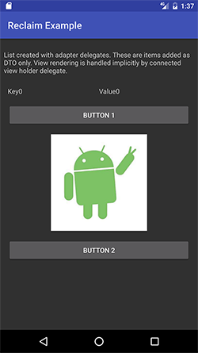

RECLAIM THE ADAPTER
============
- THE WAY THE RECYCLERVIEW IS MEANT TO BE USED!

Reclaim is a library that helps you decouple data objects from view holder rendering. You should only have to care about what type of data objects (referred to as a `Cell`) you need in your lists and there define *what* kind of behaviour you want for that cell. No *how* this cell is rendered. That should be the responsibility of and `AdapterDelegate`. No need to write custom adapters. Makes it easy to write unit tests for your lists. 

Download
--------

```groovy
dependencies {
  compile 'com.isalldigital:reclaim:0.1.0-SNAPSHOT'
  annotationProcessor 'com.isalldigital:reclaim-compiler:0.1.0-SNAPSHOT'
}
```

Note: to get snapshot version you must add the the Sonatype snapshot repository to your Maven configuration:

```groovy
repositories {
    mavenCentral()
    maven {
        url "https://oss.sonatype.org/content/repositories/snapshots/"
    }
}
```

Usage
--------

First init the manager in your application class, this is needed for the genereated code to hook up your local classes to the reclaim library: 

```java
public class ApplicationDelegate extends Application {
    @Override
    public void onCreate() {
        super.onCreate();
        AdapterDelegatesManager.init();
    }
}
```

Create the data object you want, here we want a row in our list to just hold a simple button. This should only contain the *functionality* (behaviour) of that row. This data object *MUST* implement the `DisplayableCell` interface.

```java
public class ButtonCell implements DisplayableCell {
    public String text;
    public View.OnClickListener onClickListener;

    public ButtonCell(String text, View.OnClickListener l) {
        this.text = text;
        this.onClickListener = l;
    }
}
```

Now we create an adapter delegate. An adapter delegate is responsible for how a `Cell` is rendered. One `Cell` can be rendered by one, and only one, `AdapterDelegate` but one `AdapterDelegate` can be responsible for rendering many `Cells`. Who renders what is defined by adding the annotation `@ReclaimAdapterDelegate(Cell.class)`. To implement a delegate just extend `AdapterDelegate` and create an `AdapterDelegate.ViewHolderDelegate`.

```java
@ReclaimAdapterDelegate(ButtonCell.class)
public class ButtonAdapterDelegate extends AdapterDelegate {

    static class ViewHolder extends ViewHolderDelegate {
        Button button;

        public ViewHolder(View itemView) {
            super(itemView);
            button = (Button) itemView.findViewById(R.id.button);
        }

        @Override
        public boolean needsItemDecoration() {
            return false;
        }
    }

    @NonNull
    @Override
    public ViewHolderDelegate onCreateViewHolder(LayoutInflater inflater, ViewGroup parent) {
        return new ViewHolder(inflater.inflate(R.layout.adapter_delegate_button_with_icon_and_text, parent, false));
    }

    @Override
    public void onBindViewHolder(@NonNull DisplayableCell item, @NonNull RecyclerView.ViewHolder holder, int position) {
        ViewHolder vh = (ViewHolder) holder;
        ButtonCell cell = (ButtonCell) item;
        vh.button.setText(cell.text);
        vh.button.setOnClickListener(cell.onClickListener);
    }
}
```

Now you are done! Now you can use it directly in your views without the need to write a custom adapter!

```java
public class MainActivity extends Activity {

    @Override
    protected void onCreate(Bundle savedInstanceState) {
        ...
        RecyclerView adapterView = (RecyclerView) rootView.findViewById(R.id.adapter);
        adapterView.setLayoutManager(new LinearLayoutManager(this));
        ReclaimAdapter adapter = new ReclaimAdapter(this);
        adapterView.setAdapter(adapter);

        adapter.add(new ButtonCell("Button One", new View.OnClickListener() {
            @Override
            public void onClick(View v) {
                Toast.makeText(MainActivity.this, "Click Button One", Toast.LENGTH_LONG).show();
            }
        }));
        ...
    }
}
```

YOU ARE GOOD TO GO!

More Help and Demo
-------
Checkout the project and build the the `reclaim-android-app` module to test an example application. Contains 3 sample delegates (ButtonDelegate, KeyValueDelegate and an ImageDelegate). 



License
-------

    Copyright 2016 Samuel Wejeus

    Licensed under the Apache License, Version 2.0 (the "License");
    you may not use this file except in compliance with the License.
    You may obtain a copy of the License at

       http://www.apache.org/licenses/LICENSE-2.0

    Unless required by applicable law or agreed to in writing, software
    distributed under the License is distributed on an "AS IS" BASIS,
    WITHOUT WARRANTIES OR CONDITIONS OF ANY KIND, either express or implied.
    See the License for the specific language governing permissions and
    limitations under the License.


